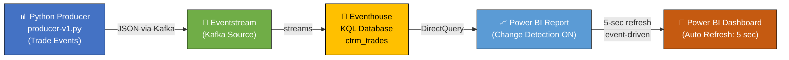

# CTRM Real-Time Streaming POC

A **commodity trading real-time monitoring** proof-of-concept using **Microsoft Fabric**, **Kafka**, **Power BI**, and **KQL** for event-driven, real-time dashboards with optimized polling (Change Detection).

---

## 📋 Project Overview

This POC demonstrates:

- **Event-driven real-time data pipeline** (Kafka → Eventstream → KQL)
- **Live trading dashboard** with sub-2-second latency
- **Cost-efficient refresh** using Power BI Change Detection (only refresh on data changes, not constantly)
- **Scalable architecture** on Microsoft Fabric Premium capacity

**Use case:** Monitor open positions, unrealized P&L, price movements, and trade events in real time.

---

## 🏗️ Architecture Diagram



---

## 🎯 Key Features

| Feature                  | Description                                                             |
| ------------------------ | ----------------------------------------------------------------------- |
| **Event-Driven Refresh** | Dashboard updates only when trades occur (not price ticks)              |
| **Change Detection**     | Power BI detects data changes via `MAX(EventEnqueuedUtcTime)` measure   |
| **Sub-2 Second Latency** | 5-second polling interval catches changes almost immediately            |
| **Cost Efficient**       | No wasted refresh cycles; skips updates when idle                       |
| **Real-Time Visuals**    | 5 interactive charts showing trades, P&L, prices, and ingestion metrics |
| **Fully Managed**        | Built on Microsoft Fabric—no infrastructure management needed           |

---

## 📊 Dashboard Visuals

Your Power BI dashboard includes:

1. **Card:** Open Trades Count (real-time count of active positions)
2. **Bar Chart:** Unrealized P&L by Commodity (position-level breakdown)
3. **Table:** Real-Time Price Updates (latest 20 price ticks)
4. **Line Chart:** Data Ingestion Events (trade open/close events over time)
5. **Line Chart:** Price Movements (commodity price trends)

All update automatically when new data arrives—thanks to Change Detection! ✅

---

## 🚀 Quick Start

### Prerequisites

- Python 3.9+
- Microsoft Fabric Premium workspace
- Power BI Desktop & Service (Pro license minimum)
- Git

### 1. Clone Repository

```bash
git clone https://github.com/saiphyo/ctrm-streaming-poc.git
cd ctrm-streaming-poc
```

### 2. Install Dependencies

```bash
pip install -r requirements.txt
```

### 3. Configure Environment

Create a `.env` file in the project root:

```
FABRIC_KAFKA_BOOTSTRAP=<your-eventhub-namespace>.servicebus.windows.net:9093
FABRIC_KAFKA_CONN_STR=Endpoint=sb://<your-namespace>.servicebus.windows.net/;...
```

**Where to get these:**

1. Go to **Fabric Eventstream** → **Connect** → **Kafka** connection
2. Copy-paste the values from the credentials dialog

### 4. Setup Fabric Components

#### Create Eventhouse & KQL Database

1. **Fabric workspace** → **+ New** → **Eventhouse**
   - Name: `ctrm-eventhouse` (or your choice)
2. **Create database:** `ctrm_trades`
3. **Create table** `ctrm_trades` with schema:
   ```kusto
   .create table ctrm_trades (
       timestamp: datetime,
       commodity: string,
       CurrentPrice: real,
       Volume: real,
       TradeID: int,
       Quantity: real,
       EntryPrice: real,
       Status: string,
       PositionType: string,
       ClosePrice: real,
       UnrealizedPnL: real,
       RealizedPnL: real,
       EventType: string,
       LastUpdatedUtc: datetime
   )
   ```

#### Setup Eventstream

1. **Fabric workspace** → **+ New** → **Eventstream**
   - Name: `ctrm-es`
2. **Add Kafka source:**
   - Credentials: Use `.env` values
   - Data format: JSON
3. **Add KQL destination:**
   - Cluster: Your Eventhouse endpoint
   - Database: `ctrm_trades`
   - Table: `ctrm_trades`
   - Format: JSON
4. **Verify:** Both source & destination show green ✅

#### Setup Power BI

1. **Power BI Desktop** → **Get Data** → **KQL Database**

   - Cluster: `https://trd-<region>.z2.kusto.windows.net/`
   - Database: `ctrm_trades`
   - Table: `ctrm_trades`
   - **Mode: DirectQuery** (critical!)

2. **Create visuals** (5 total):

   - **Card:** `COUNT(TradeID where Status='Open')`
   - **Bar Chart:** `SUM(UnrealizedPnL) by commodity`
   - **Table:** Filter `EventType='PriceTick'` → show price updates
   - **Line Chart:** `COUNT by timestamp` (data ingestion)
   - **Line Chart:** `MAX(CurrentPrice) by timestamp, commodity` (price trends)

3. **Enable Change Detection:**

   - **Format pane** → **Page refresh** → **Change Detection: ON**
   - **Detector Measure:** `MAX(ctrm_trades[EventEnqueuedUtcTime])`
   - **Check interval:** 5 seconds

4. **Publish to Power BI Service**

5. **Create dashboard** (optional):
   - Pin all visuals from report
   - **Dashboard Settings** → **Automatic page refresh: ON**
   - **Interval:** 5 seconds

---

## ▶️ Running the Project

### Start the Kafka Producer

```bash
python producer-v1.py
```

**Expected output:**

```
============================================================
CTRM KAFKA PRODUCER - WITH PRICE CHANGE DETECTION
============================================================
✓ Sent to es_e4bdbac5... [0] @ offset 1
✓ Sent to es_e4bdbac5... [0] @ offset 2
...
```

### Verify Data Flow

1. **Eventstream dashboard:**

   - Both tiles show green ✅
   - Metrics show incoming messages

2. **Eventhouse query:**

   ```kusto
   ctrm_trades
   | where timestamp > ago(5m)
   | take 10
   ```

3. **Power BI dashboard:**
   - Visuals update automatically (every 5 seconds if data changed)
   - New trades → card count increases
   - Price updates → price chart moves
   - Close trades → count decreases

---

## 📝 Producer Events

The `producer-v1.py` generates three event types:

### 1. **PriceTick**

- Updates current commodity prices
- Occurs every 5 seconds
- Example:
  ```json
  {
    "timestamp": "2025-11-13T07:30:00Z",
    "commodity": "Oil",
    "CurrentPrice": 102.45,
    "Volume": 2500,
    "EventType": "PriceTick"
  }
  ```

### 2. **TradeOpened**

- Opens a new position
- Increments TradeID
- Example:
  ```json
  {
    "TradeID": 5,
    "commodity": "Gold",
    "Quantity": 500,
    "EntryPrice": 98.5,
    "PositionType": "Long",
    "Status": "Open",
    "EventType": "TradeOpened"
  }
  ```

### 3. **TradeClosed**

- Closes an open position
- Calculates realized P&L
- Example:
  ```json
  {
    "TradeID": 5,
    "Status": "Closed",
    "ClosePrice": 99.2,
    "RealizedPnL": 350.0,
    "EventType": "TradeClosed"
  }
  ```

---

## 🔧 Change Detection Explained

**How it works:**

Every 5 seconds, Power BI checks:

```
MAX (ctrm_trades[LastUpdatedUtc]) == previous_value?
```

- **If YES** (no new data): Skip refresh ✓ (efficient!)
- **If NO** (new data): Refresh all visuals ✓ (real-time!)

**Result:** Dashboard only updates when trades or prices change—**no wasted cycles!**

---

## 🎯 Demo Flow

1. **Open Power BI dashboard in Service**
2. **Start producer** (`python producer-v1.py`)
3. **Watch dashboard:**

   - New trade opens → Card count increases instantly
   - Prices update → Price chart line moves
   - Trade closes → Count decreases
   - All within 1-2 seconds! ⚡

4. **Explain to stakeholders:**
   - "Event-driven: only refreshes when actual trades happen"
   - "No noise from price ticks alone—just the business events matter"
   - "Real-time insights with optimized resource usage"

---

## 📚 Project Structure

```
ctrm-streaming-poc/
├── producer-v1.py          # Kafka event producer
├── requirements.txt        # Python dependencies
├── .env                    # Environment variables (git-ignored)
├── README.md              # This file
└── assets/
    └── dashboard.png      # Screenshot of Power BI dashboard
```

---

## 🔑 Key Configuration

| Component             | Setting    | Value             |
| --------------------- | ---------- | ----------------- |
| **Producer**          | Interval   | 5 seconds         |
| **Eventstream**       | Format     | JSON              |
| **KQL**               | Retention  | Default (90 days) |
| **Power BI**          | Query Mode | DirectQuery       |
| **Change Detection**  | Interval   | 5 seconds         |
| **Dashboard Refresh** | Interval   | 5 seconds         |

---

## 🚨 Troubleshooting

### Data not reaching Eventhouse

- Check Eventstream destination status (green ✅?)
- Verify KQL table schema matches producer output
- Try deleting & re-adding Eventstream destination

### Dashboard not refreshing

- Confirm Power BI Premium workspace (Change Detection requires Premium)
- Check "Automatic page refresh" in dashboard settings
- Verify Change Detection measure is set correctly

### Producer keeps disconnecting

- Check `.env` credentials
- Ensure Fabric capacity is running
- Restart producer with: `python producer-v1.py`

---

## 📖 Further Reading

- [Microsoft Fabric Documentation](https://learn.microsoft.com/en-us/fabric/)
- [KQL Query Language Reference](https://learn.microsoft.com/en-us/kusto/query/)
- [Power BI Change Detection Guide](https://learn.microsoft.com/en-us/power-bi/create-reports/automatic-page-refresh)

---

## 📄 License

This project is provided as-is for educational and POC purposes.

---

## 🤝 Contributing

Have improvements or questions? Feel free to:

- Open an issue
- Submit a pull request
- Reach out with feedback

---

## ✅ Next Steps

- ✅ Clone & setup (see Quick Start above)
- ✅ Run producer and verify data flow
- ✅ Build Power BI dashboard
- ✅ Demo to stakeholders
- 🚀 Deploy to production with additional safeguards (monitoring, alerts, etc.)
